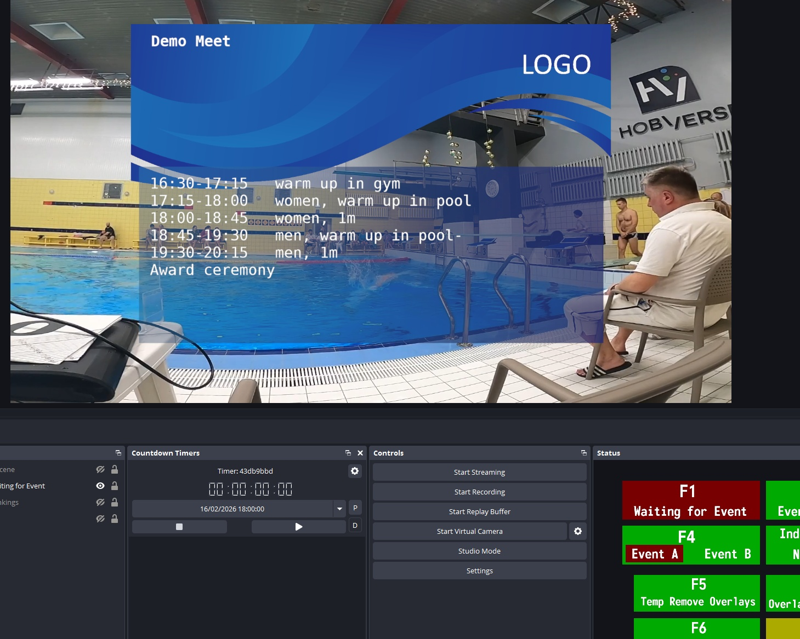
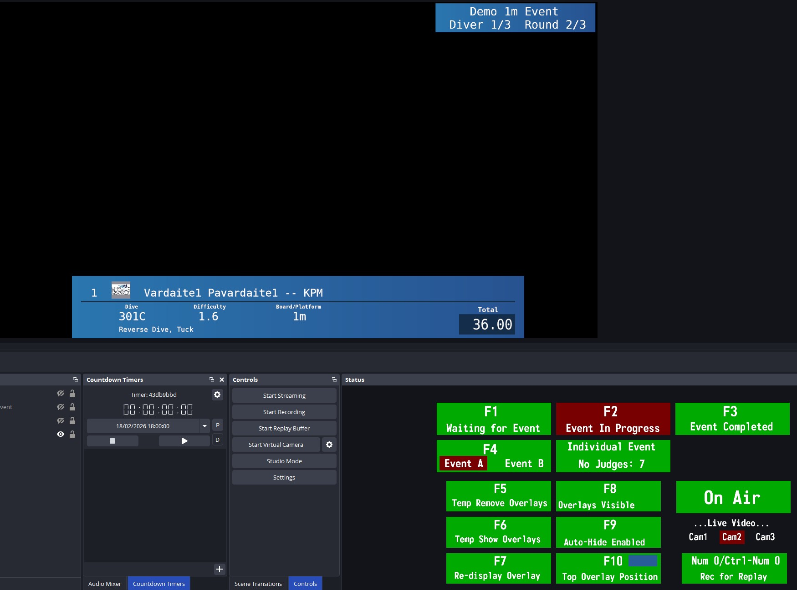
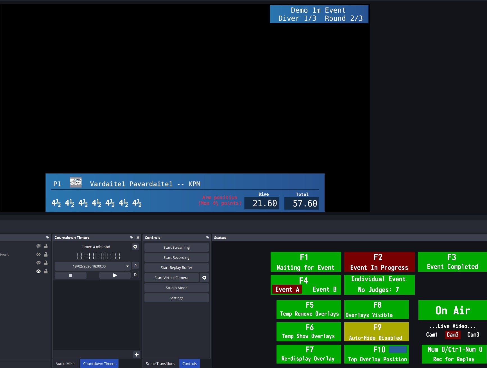
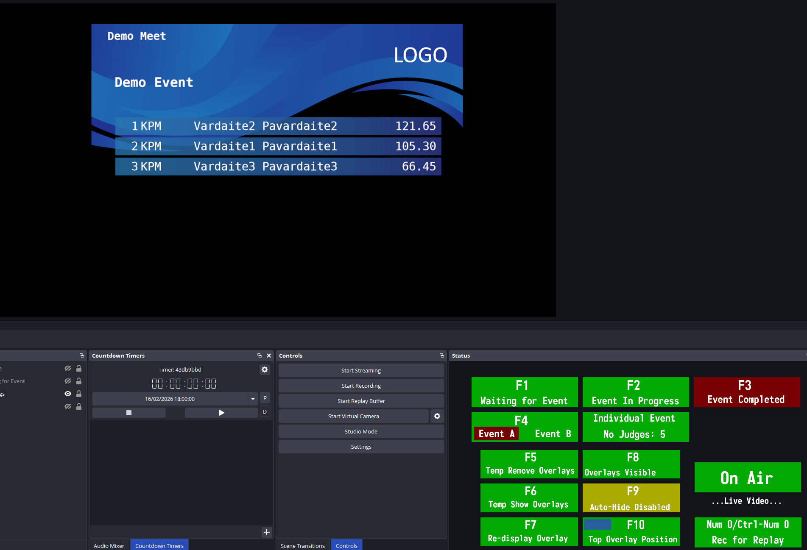
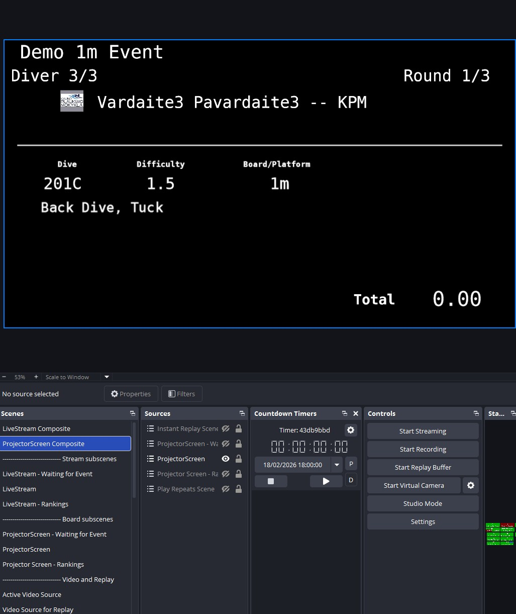
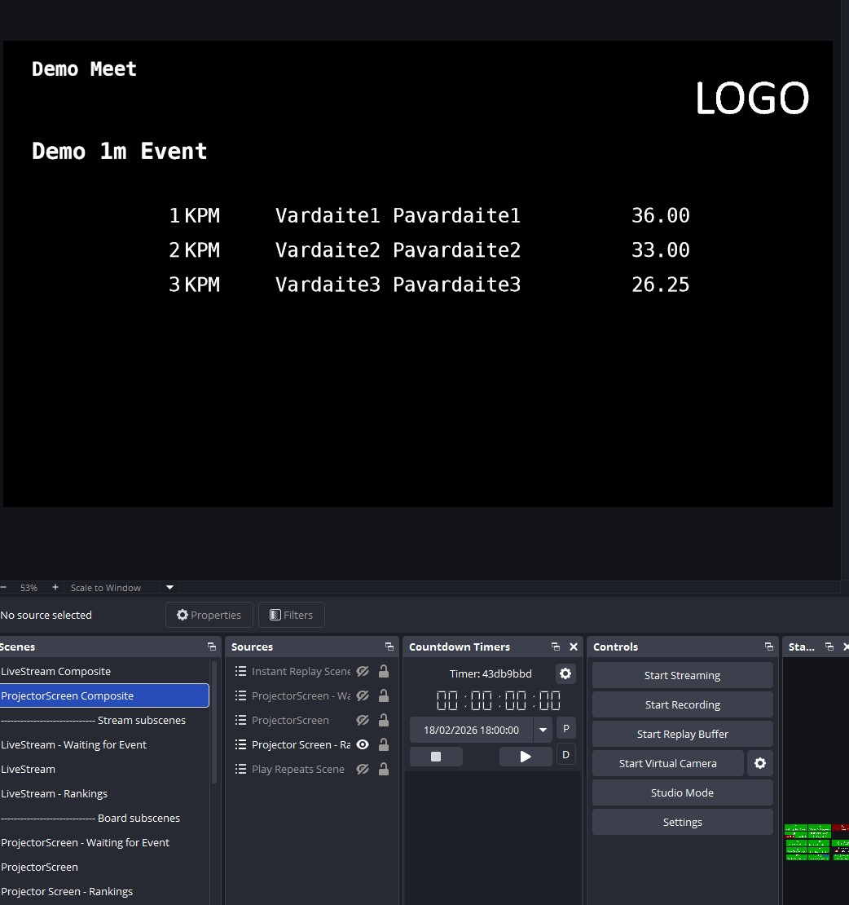

# Diving Overlays And Scoreboard

[OBS studio](https://obsproject.com/) Python script/scenes to present springboard/platform diving competition information in overlays for live streaming and on scoreboard in venue.  
Python port and heavy refactoring from @andy5211d [Andy's DR2TVOverlay](https://github.com/andy5211d/DR2TVOverlay)
Designed more for "single man orchestra" operations :) - automated as much as possible.   
Supported diving software: [DiveRecorder 7.0.7.6](https://diverecorder.co.uk)

**Functionality**:

- Supported event types:
    - Individual
    - Synchro

- Event modes:
    - Waiting for event displays
        - Countdown to next event (managed by Countdown Timer in OBS)
        - Event schedule (from text file)
        - Start list (UDP/TCP communication with DiveRecorder)
        - Dive replays ("Highlights") from recorded Instant Replay clips (in development)
    - Event in progress
        - Next Diver/Dive information (UDP from DiveRecorder)
        - Dive scores/penalties/totals (UDP from DiveRecorder)
        - Instant dive replay (OBS hotkeys)
    - Event results
        - Rankings (UDP/TCP communication with DiveRecorder)
        - Reveal/Show All modes (managed from DiveRecorder)
        - Dive replays from recorded Instant Replay clips (in development)

- Streaming:
    - Multiple camera support. Camera switches performed by hotkeys, not scene switching in OBS
    - Instant Replay (slow motion)
    - Instant Replay source can be set to specific camera in multiple camera setup or to active camera.
      
- Video Scoreboard
    - Data from DiveRecorder is displayed simultanously in overlays for video live streaming and scenes, that can be used on video scoreboards
      
- Simultaneous events
    - can choose one of events (A or B) - can switch anytime, but not recommended (i.e. switch to correct one before event)
    - streaming info of both events is not supported

- Status/Common hotkeys board

- Language - English only (dive position/penalty text hardcoded, dive description is provided by DiveRecorder)

## Installation

### Fonts
Download and install two monotype fonts: **'DejaVu Sans Mono Book' and 'Monofonto Regular'**.

### Required OBS Plugins:

- [Countdown Timers](https://obsproject.com/forum/resources/ashmanix-countdown-timer.1610/) (for event countdown)
- [Gradient Source](https://obsproject.com/forum/resources/gradient-source.1172/) (for graphics elements)
- [Move Transition](https://obsproject.com/forum/resources/move.913/) (for instant replay transitions)
- [Source Dock](https://obsproject.com/forum/resources/source-dock.1317/) (for status board)
- [advanced-scene-switcher](https://obsproject.com/forum/resources/advanced-scene-switcher.395/) (for scene scripting)
- [dir-watch-media](https://obsproject.com/forum/resources/directory-watch-media.801/) (for instant replay support)
- [osi-branch-output](https://obsproject.com/forum/resources/branch-output-streaming-recording-filter-for-source-scene.1987/) (for instant replay support)

### Python

Python 3.10 (latest supported by OBS). Set the path in OBS script settings.

### Script/scene installation

Download ZIP, unzip into local folder, import Scene Collection and Profile, point OBS to script dive_recorder_overlays.py

### Notes when upgrading

When there's new version of the script/scenes, keep in mind:
- Replacing scenes json with the newest downloaded version will replace **ALL** customizations that you did. This involves additional graphics you added or moved/removed, color/text changes etc. If the changes you did do not conflict with the changes from repository, you can try merging in some diff tool, but it's risky process. Make backups just in case.
- I think you need to remove .json.bak file before applying new scene collection, otherwise it will just restore old one from backup. Make backup of backup just in case ;)
- **Do not** replace Media folder, as it will reset Header, HeaderLogo etc. media back to defaults.

## Setup

### Camera setup

Most likely you will need to add and use your specific camera source(s).
Up to 3 simultanous cameras are supported "out of the box" - to add more, you will need to change/add Advanced Scene Switcher macros.  
  
Add your camera source to one of *Camera1..2* scenes. Scene can contain multiple cameras, the one that is set to visible (or is "on top") will be shown when you select that camera number.  
  

One of Camera scenes contain Fake Camera media source, that you can point to, e.g. video recording of actual competition, enable it and use it to test and learn operations (Instant Replay will work too)  

### Instant replay setup

To use currently active camera as a source for Instant Replay:  
    - Set *Video Source for Replay/Active Video Source* to visible, set *Video Source for Replay/Camera1..3* sources to NOT visible.  
To use specific camera:  
    - Set corresponding source *Video Source for Replay/Camera1..3* to visible, set other sources to NOT visible  

This is convenient if you would like to stream dive in real time from various cameras, but always show dive repeat from single camera.  

**Notes:**  
- Replay clips are placed in Replay folder.  This folder is not cleaned-up - take care of it! Next time you start OBS after cleanup, you might get error about missing replay file. Ignore it.
- Why not use "Native" OBS studio Replay buffer? Unreliable.
- There's some lag between hotkey press and recording. Get some practice, use Fake Camera!
- Replay clips are limited to 10s - recording will stop automatically. Some divers take their time on the board. Might want to setup hotkey to cut recording short without showing replay and start recording again (TODO).

### Media

Replace files with your art in Media/Art folder. If picture sizes are different from current ones, sources might need adjusting in corresponding scenes.

## Operation

### Scenes

- use *LiveStream Composite* for streaming.
- use *ProjectorScreen Composite* for HD Video scoreboard (1920x1080): Right click on scene->Open Scene Projector->Select scoreboard display.

### Main Hotkeys

**Scene controls:**  
**F1** - switch to Waiting for Event scene  
**F2** - switch to Event in Progress scene  
**F3** - switch to Event Completed scene  

**Event controls:**  
**F4** - toggle between A and B events  

**Overlay controlls:**  
**F5** - hide overlays temporary, clear scoreboard screen until next update from DiveRecorder  
**F6** - redisplay top overlay, no effect in scoreboard  
**F7** - redisplay all overlays, redisplay scoreboard  
**F8** - disable overlays, clear scoreboard until re-enabled  
**F9** - turn off autohide, overlays shown permanently, no effect on scoreboard.  
**F10** - toggle position of top overlay  

**Num 0** - start recording for instant replay  
**Ctrl-Num 0** - stop recording and show instant replay  
**Ctrl-Alt-Num 0** - stop recording  

**Ctrl-Num 1** - switch livestream to Camera1  
**Ctrl-Num 2** - switch livestream to Camera2  
**Ctrl-Num 3** - switch livestream to Camera3  

**Num +** - show/hide instant replay  
**Num -** - show repeats (repeats are played until switched to different camera)  

**Overlay toggles in Waiting for Event mode**  
**Ctrl-Q** - countdown display  
**Ctrl-W** - start list (valid only when recording is setup in DiveRecorder)  
**Ctrl-E** - schedule (set the text in Data/schedule.txt)  

**Ctrl-R** - toggle rankings overlay in Event Complete mode  

### Notes

Meet title/event title will not be populated unless DiveRecorder is in Recording or Results Display mode.

## Screnshots

### Overlays

### Scoreboard

## Future plans

### Short term
- If there's no data for rankings list, do not show headers (now just header is displayed)
- Test with Team events (should probably work, it's mainly how DR presents info)
- Test with events, where divers carries some points over to the next event
- Use different spacing between scores for different judge numbers.
- *Studio Mode*-friendly scene collection (maybe more suited for serious streaming and important events, as with Studio Mode you can verify that the scene shows what you intended to before switching to it)

### Long term
- Integration with *Divecalc*

