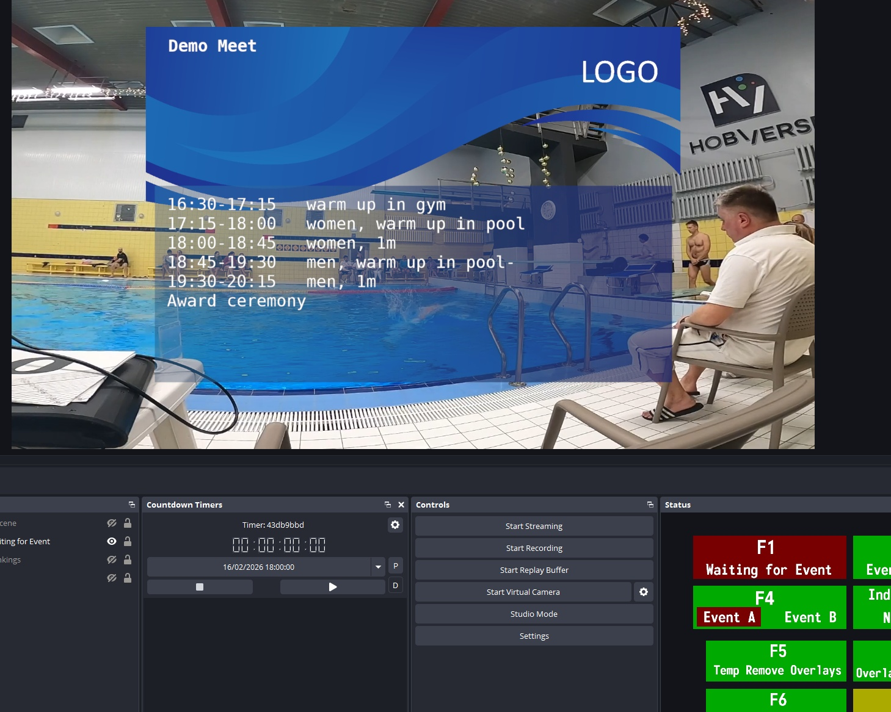
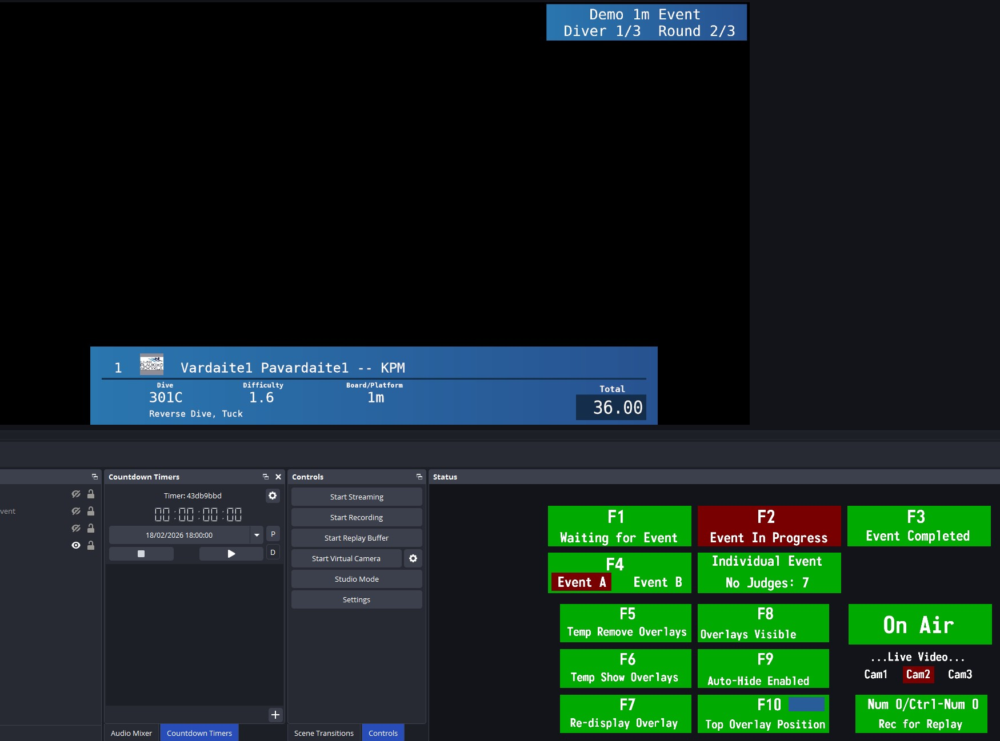
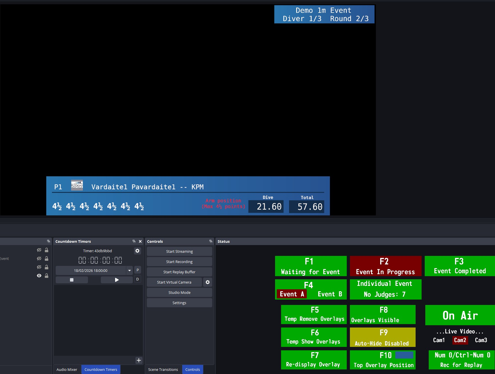
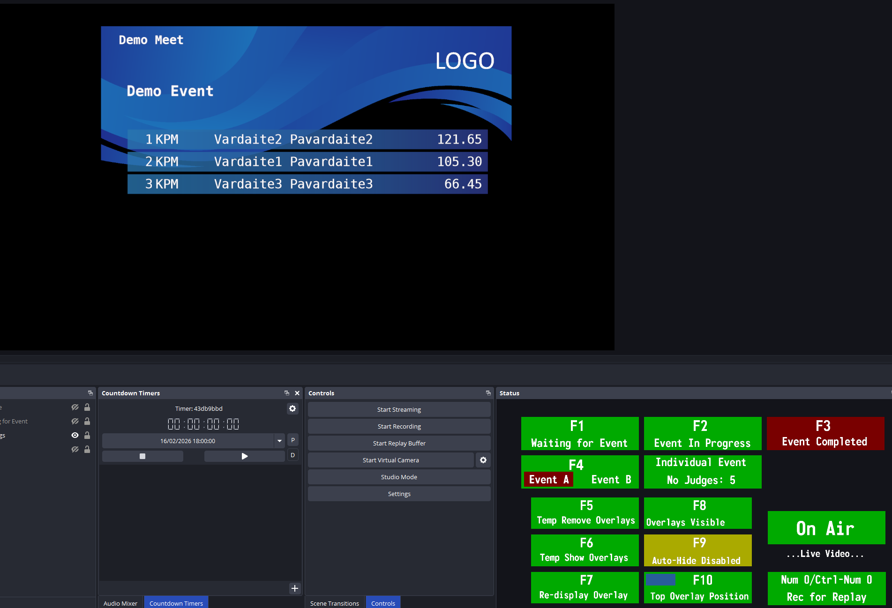
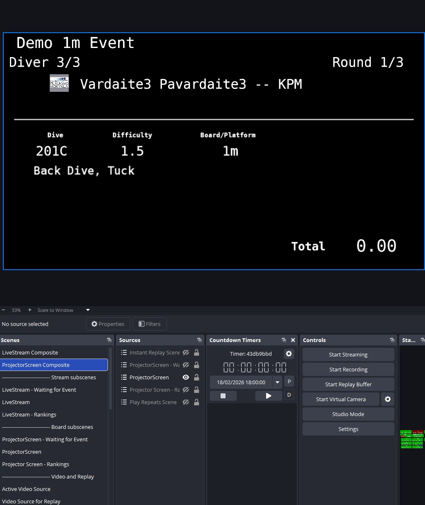
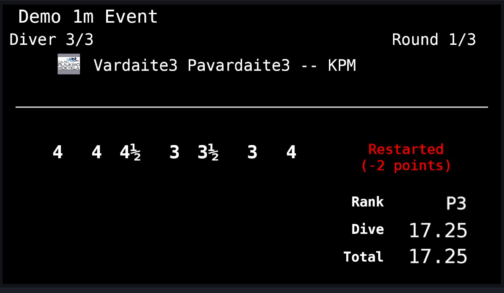
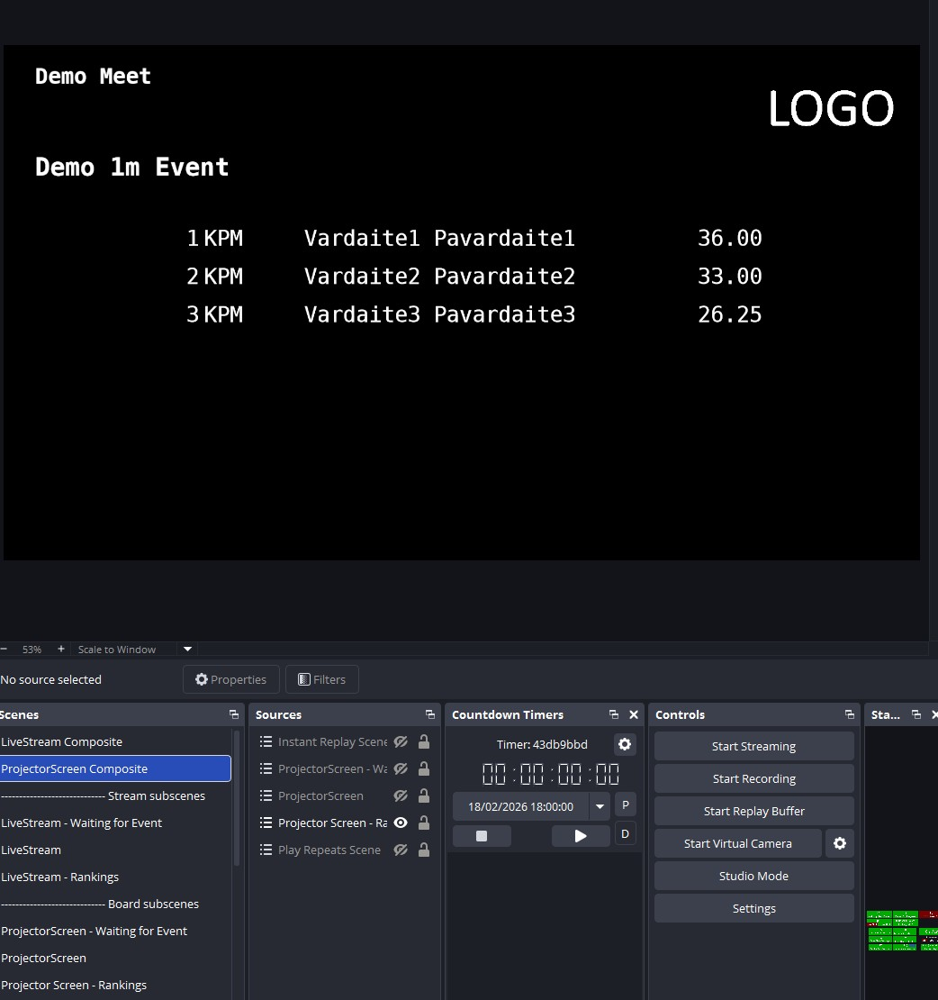

# Diving Overlays And Scoreboard

[OBS studio](https://obsproject.com/) Python script/scenes to present springboard/platform diving competition information in overlays for live streaming and on scoreboard in venue.  
Python port and heavy refactoring from @andy5211d [Andy's DR2TVOverlay](https://github.com/andy5211d/DR2TVOverlay)  
Supported diving software: [DiveRecorder 7.0.7.6](https://diverecorder.co.uk)

## Updates

### Version 1.1.0: What's new?
- Instead of single LiveStream Composite scene (in 1.0.0) there are now separate scenes for different views.
    - LiveStream - Waiting for Event - Countdown
    - LiveStream - Waiting for Event - Schedule
    - LiveStream - Waiting for Event - Start List
    - LiveStream - Waiting for Event - Clean
    - LiveStream
    - LiveStream - Rankings - Clean
    - LiveStream - Rankings
    This setup makes it easier to use in Studio Mode. It allows you to verify what's going to appear on the screen. Previous, hotkey-based approach resulted in some surprises (e.g. list not ready, used wrong hotkey, etc.)  
    F1-3 are still relevant. They swith the script to correct mode. They also switch to corresponding scenes:
        - **F1**: LiveStream - Waiting for Event - Clean
        - **F2**: LiveStream
        - **F3**: LiveStream - Rankings - Clean
- Different score spacing for different judge numbers. Now, if there are 5 judges, scores aren't bunched up on one side, but evenly distributed.
- Added group of scenes "Customizable Graphics". Scenes in the group contain references to design elements (e.g. overlay background gradients), so that it would be easier to modify all these in one place instead of searching for them in all scenes.
- Added different Instant Replay options and created framework to make customizations/switching between them easier.
- Switched to Stinger transition for "Slide logo in/out, show repeat, slide logo in/out" Instant Repeat display. Still left old Move Source - based (Replay Scene 1), in case you want to have similar effect, but don't want to bother with your own video creation for Stinger transitions.

### For those who installed and still have 1.0.0 version
!!! I accidently left Branch Output filters on two of the Video Capture Sources in _Camera 1..3_ scenes and one on _Active Camera Source_ scene. They silently recorded hours and hours of black until my drive run out of space (that's when I noticed it).  
Look for files CanonForReplay*.mp4 and ForReplay*.mp4 in your drive (default Recordings output folder I think) - if you started using these scene collections, most likely these filters are active on your machine too.  
Remove Branch Output filters from these camera sources and scene and delete files. There should NOT be any BO filters on camera sources in Camera1..3 (unless you put some there yourself for whatever reason).  
Sorry :(

## Functionality

- Supported event types:
    - Individual
    - Synchro

- Event modes:
    - Waiting for event displays
        - Countdown to next event (managed by Countdown Timer in OBS)
        - Event schedule (from Data/schedule.txt)
        - Start list (UDP/TCP communication with DiveRecorder)
        - Dive replays ("Highlights") from recorded Instant Replay clips (in development)
    - Event in progress
        - Next Diver/Dive information (UDP from DiveRecorder)
        - Dive scores/penalties/totals (UDP from DiveRecorder)
        - Instant dive replay (OBS hotkeys)
    - Event results
        - Rankings (UDP/TCP communication with DiveRecorder)
        - Reveal/Show All modes (managed from DiveRecorder)
        - Dive replays from recorded Instant Replay clips (in development)

- Streaming:
    - Multiple camera support. Camera switches performed by hotkeys, not scene switching in OBS
    - Instant Replay (slow motion)
        - Various alternative transitions to instant replays/easy switch between them
    - Instant Replay source can be set to specific camera in multiple camera setup or to currently active camera.

- Video Scoreboard
    - Data from DiveRecorder is displayed simultanously in overlays for video live streaming and scenes designed to be used on video scoreboards

- Simultaneous events
    - can choose one of events (A or B) - can switch anytime, but not recommended (i.e. switch to correct one before event)
    - streaming info of both events is not supported

- Status/Common hotkeys board

- Language - English only (dive position/penalty text hardcoded, dive description is provided by DiveRecorder)

## Installation

### Fonts
Download and install two monotype fonts: **'DejaVu Sans Mono Book' and 'Monofonto Regular'**.

### Required OBS Plugins:

- [Countdown Timers](https://obsproject.com/forum/resources/ashmanix-countdown-timer.1610/) (for event countdown)
- [Gradient Source](https://obsproject.com/forum/resources/gradient-source.1172/) (for graphics elements)
- [Move Transition](https://obsproject.com/forum/resources/move.913/) (for instant replay transitions)
- [Source Dock](https://obsproject.com/forum/resources/source-dock.1317/) (for status board)
- [advanced-scene-switcher](https://obsproject.com/forum/resources/advanced-scene-switcher.395/) (for scene scripting)
- [dir-watch-media](https://obsproject.com/forum/resources/directory-watch-media.801/) (for instant replay support)
- [osi-branch-output](https://obsproject.com/forum/resources/branch-output-streaming-recording-filter-for-source-scene.1987/) (for instant replay support)

### Python

Python 3.10 (latest supported by OBS). Set the path in OBS script settings.

### Script/scene installation

1. Download ZIP
2. Unzip into local folder. Folders will contain imports for following items.
3. Import Scene Collection (Scenes/Diving_Streaming_and_Board.json). You will get "missing files" dialog, press "Search folder" and point it to the folder from step 2.
4. Import Profile (Profile/DivingStreamingAndBoard)
5. Add script dive_recorder_overlays.py

**Note:** After you install the script, cycle all F1 hotkeys several times. Do the same if you remove and re-install the script.

### Notes when upgrading

When there's new version of the script/scenes, keep in mind:
- Replacing scenes json with the newest downloaded version will replace **ALL** customizations that you did. This involves additional graphics you added or moved/removed, color/text changes etc. If the changes you did do not conflict with the changes from repository, you can try merging in some diff tool, but it's risky process. Make backups just in case.
- I think you need to remove .json.bak file before applying new scene collection, otherwise it will just restore old one from backup. Make backup of backup just in case ;)
- **Do not** replace Media folder if you replaced with your graphics, as it will reset Header, HeaderLogo etc. media back to defaults.

## Setup

### Script settings

Can set various parameters in script settings - most are self-explanatory.  
Regarding number of records in Rankings/Start List:  
Streaming scene would fit 10 records easily, but I found that on the Scoreboard font is too small to comfortably read, so it fits only 8. You can choose 10 in script settings, but it will mess up the scoreboard, so 8 is recommended.  
If you have bigger scoreboard, modify BoardRankings scene (it already has 10 lines prepared, but last two not positioned).

### Camera setup

Most likely you will need to add and use your specific camera source(s).  
Up to 3 simultanous cameras are supported "out of the box" - to add more, you will need to change/add Advanced Scene Switcher macros.  
  
Add your camera source to one of *Camera1..2* scenes. Scene can contain multiple cameras, the one that is set to visible (or is "on top") will be shown when you select that camera number.  
  
One of Camera scenes contain Fake Camera media source, that you can point to, e.g. video recording of actual competition, enable it and use it to test and learn operations (Instant Replay will work too)  

### Instant replay setup

To use currently active camera as a source for Instant Replay:  
    - Set *Video Source for Replay/Active Video Source* to visible, set *Video Source for Replay/Camera1..3* sources to NOT visible.
To use specific camera:  
    - Set corresponding source *Video Source for Replay/Camera1..3* to visible, set other sources to NOT visible

This is convenient if you would like to stream dive in real time switching between various cameras, but always show dive repeat from specific camera. E.g some dives look good from the back, but side camera is more "technical".

You can setup and switch between (but not "online") multiple Instant Replay transitions. I previously used Move-Source based transitions (poster of the meet slides in/out, replay video is show, poster slides in/out, live video resumes), but then switched to prerecorded transition video and OBS "native" Stinger transitions, because Move Source based transitions were quite unreliable. But I still left one (Replay Scene 1) based on Move Source filters for your convenience, since it's easy to modify - just replace curtain.png and curtain_logo.png in Media/Art folder and you are good to go. Replay Scene 2 and 3 are based on prerecorded transition videos - you will have to create your own videos with your graphics.

**How to switch between Instant Replay transitions:**
- in *Advanced Scene Switcher* modify macro *Instant Replay Scene controls/IRS: Trigger Scene* - enable action that shows Replay Scene you have chosen.
- in *Instant Replay Scene* make corresponding Replay Scene visible.

**How to add your own Replay Scene transition:**
- make duplicate of existing Replay Scene
- right click on new scene, choose Filters, rename filter (if you duplicated *Replay Scene 2 or 3*) to, e.g. "RS4: Hide Video on Finish". This filter is still required to hide media source when it finishes to trigger Hide transition.
- add your new scene as a subscene to *Instant Replay Scene*, make it visible, hide others
- go to *Advanced Scene Switcher*, in *Instant Replay Scene controls* group:
    - duplicate e.g. *RS2: Sync video and ReplaySign*, rename and change condition and action accordingly
    - duplicate e.g. "RS2: Hide after Replay ends", rename and change condition accordingly
    - add your scene action to *IRS: Trigger Scene*, disable others

I've included DaVinci Resolve project for creating Stinger transitions video, but I think it stores absolute paths, so you will have to relink media if you want to use it.

**Notes:**
- Replay clips are placed in Replay folder.  This folder is not cleaned-up - take care of it! Next time you start OBS after cleanup, you might get error about missing replay file. Ignore it.
- Why not use "Native" OBS studio Replay buffer? Unreliable.
- I also noticed that sometimes Media Source refuses to play. OBS restart usually helps.
- There's some lag between hotkey press and recording. Get some practice, use Fake Camera!
- Replay clips are limited to 10s - recording will stop automatically. Some divers take their time on the board, and if you realize that that's the case, cut recording short without triggering replay and start again (see hotkeys).
- Replay is played both in LiveStream and on Scoreboard scenes (beware if your Scoreboard is low res - but you will have to modify scenes to fit it anyway).

### Media

Replace files with your art in Media/Art folder, do not change file names. If picture sizes are different from current ones, sources might need adjusting in corresponding scenes.

## Operation

### Scenes

- use *LiveStream \** scenes for streaming.  
- use *ProjectorScreen Composite* for HD Video scoreboard (1920x1080): Right click on scene->Open Scene Projector->Select scoreboard display.  

### Countdown

Set the timer in Countdown Timers dock. Meet title will be populated only if you perform some actions in DiveRecorder - e.g. start Recording or Display Results

### Communication/work with DiveRecorder

## Pre-Event

Start list will be populated only if you start Recording in Dive Recorder (and choose Use Scoreboards from menu). There's no need to enter scores, start list will be populated automatically.  
To show start list you need to be in Waiting for Event mode. Otherwise ranking list will be shown even if you switch to *LiveStream - Waiting for Event - Start List* scene.  
If there's more than one page in start list, it will scroll automatically (time each page is shown is managed in script settings)  
  
Use *LiveStream - Waiting for Event - \** scenes.  
  
Scoreboard will switch to corresponding scene automatically.

## Event

Once you start recording in Dive Recorder (do not forget to press **Use Scoreboards** in menu - otherwise overlays will not receive data!), switch to Event in Progress mode and *LiveStream* scene. You can manage overlay visibility/etc with **F5-9** keys.  
In this scene/mode you can use hotkeys to record clips for Instant Replay

## Event Completed

Once Event is completed, red square in "Event Completed" status board will show up (but you will have to switch to Event Completed mode manually).  
Use *LiveStream - Rankings \** scenes.  
In Dive Recorder you can go to *Results* menu, choose corresponding event and press Display to send results to OBS. Rankings list will be filled.

### Main Hotkeys

**Scene controls:**  
**F1** - switch to Waiting for Event scene/mode  
**F2** - switch to Event in Progress scene/mode  
**F3** - switch to Event Completed scene/mode  
  
**Event controls:**  
**F4** - toggle between A and B events  
  
**Overlay controlls:**  
**F5** - hide overlays temporary, clear scoreboard screen until next update from DiveRecorder  
**F6** - redisplay top overlay, no effect in scoreboard  
**F7** - redisplay all overlays, redisplay scoreboard  
**F8** - disable overlays, clear scoreboard until re-enabled  
**F9** - turn off autohide, overlays shown permanently, no effect on scoreboard.  
**F10** - toggle position of top overlay  
  
**Num 0** - start recording for instant replay  
**Ctrl-Num 0** - stop recording and show instant replay  
**Ctrl-Alt-Num 0** - stop recording  
  
**Ctrl-Num 1** - switch livestream to Camera1  
**Ctrl-Num 2** - switch livestream to Camera2  
**Ctrl-Num 3** - switch livestream to Camera3  
  
**Num +** - show/hide instant replay  
**Num -** - show repeats (repeats are played until switched to different camera)  
  
### Notes

Meet title/event title will not be populated unless DiveRecorder is in Recording or Results Display mode.  

## Screnshots

(not changed for v1.1.0, but general looks hasn't changed much)

### Overlays

### Scoreboard

## Future plans

### Short term
- If there's no data for rankings list, do not show headers (now just header is displayed)
- Test with Team events (should probably work, it's mainly how DR presents info)
- Test with events, where divers carries some points over to the next event
- Multiple language support (where I have control - e.g. dive descripions come from DiveRecorder)

### Long term
- Integration with *Divecalc*

## Comments

Please post comments/problems/suggestions under resource listing in [OBS forums](https://obsproject.com/forum/resources/diving-competition-streaming-overlays-and-scoreboard-display.2386/)
